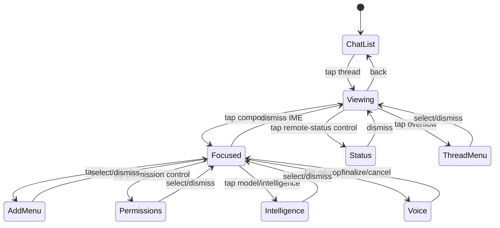

# Dealer Chat MVP — ChatGPT Remote Mobile Baseline

**Status:** Accepted pre-SPEC visual/interaction reference; non-normative  
**Visual source:** Eight user-supplied ChatGPT Remote Android screenshots captured 2026-08-25  
**Reference canvas:** 390 × 956, preserving the supplied 626 × 1536 aspect ratio

## 1. Source hierarchy

1. Supplied screenshots are the visual source of truth only for states they visibly show.
2. Current Codex app-server protocol/docs are the behavioral source of truth.
3. Poker-Dealer invariants govern host-qualified identity, recovery, uncertain mutation handling, and Poker attachment.
4. Missing states must not be extrapolated as if the screenshots specified them.

No public pixel-level ChatGPT Remote Figma/component specification was identified during the design exploration; screenshot geometry is therefore a reference rather than an upstream API contract.

## 2. MVP boundary

Dealer should closely reproduce the supplied Remote Chat layout and interaction grammar:

- Floating thread/context header
- Conversation timeline
- Assistant text layout
- User bubble treatment
- Code block/copy treatment
- Collapsed and focused composer
- Add/plugin menu
- Permission menu
- Intelligence/model/speed menu
- Voice composer
- Remote-session status panel
- Thread overflow menu
- Android keyboard/system chrome integration

Do not recreate the Android status bar, keyboard, or gesture bar as Dealer UI.

Do not copy ChatGPT/OpenAI logos, product naming, or trademarked branding.

## 3. Geometry reference

Measurements are normalized from the supplied screenshots and are approximate targets, not fixed device constants.

- Frame: `390 × 956`
- Background: black
- Horizontal content inset: approximately `13–17`
- Floating header: top ~`51`, height ~`51`, side inset ~`14`
- Back control: ~`51 × 51`
- Header context pill: flexible width, ~`51` high
- Header action pill: ~`98 × 51`
- Collapsed composer: side inset ~`13`, height ~`50`, pill radius ~`25–30`
- Focused composer: ~`98` high in captured state, two-row control layout
- Add/plugins popover: ~`320` wide
- Permissions popover: ~`316` wide
- Intelligence popover: ~`210` wide
- Remote-status panel: ~`318` wide
- Thread-actions popover: ~`227` wide

Approximate dark tokens sampled from screenshots:

- background `#000000`
- surface `#212121`
- code/subtle surface `#151515`
- raised surface `#2B2B2B`
- border `#3B3B3B`
- primary text `#F5F5F5`
- secondary text `#AAAAAA`
- user bubble `#133362`
- warning `#EFA071`
- destructive `#F27778`

Android system sans / Roboto-like typography is the implementation reference; monospace content uses platform monospace/Roboto Mono equivalent.

## 4. Screenshot-supported states

### S0 — Viewing

- Keyboard hidden.
- One-row pill composer.
- Add button, prompt placeholder, microphone.
- Floating header and timeline remain visible.

### S1 — Focused composer

- Android IME visible.
- Composer expands.
- Lower row exposes add, permission indicator, model/intelligence selector, microphone/send affordance.

### S2 — Add/plugins

Visible:

- Upload photo
- Plan mode
- Plugins section
- Plugin rows with title + description
- Scrollable menu

### S3 — Permissions

Visible labels:

- Default permissions
- Auto-review
- Read only
- Full access
- Custom (`config.toml`)

Important: these rows do **not** all correspond to one protocol enum. Permission profile, approval policy, and approval reviewer remain separate Codex semantics. Exact mapping must be grounded in the current app-server version during SPEC refinement.

### S4 — Intelligence/model/speed

Visible:

- Low
- Medium
- High
- Extra High
- Max
- Ultra
- Nested Model row
- Nested Speed row

Nested Model/Speed screens were not supplied. Their contents must come from current host/app-server capabilities rather than screenshot inference.

### S5 — Voice capture

Visible:

- Waveform composer
- Stop/finalize control
- Send control
- IME still visible in the supplied capture

The screenshots do not fully define ASR/recording lifecycle.

### S6 — Remote-session status

Visible:

- Status heading
- Active remote session
- Thread ID + copy affordance
- Directory
- Context usage
- Seven-day usage/reset information

Dealer must mark stale/unknown values when authority is unavailable rather than presenting cached data as live.

### S7 — Thread overflow

Visible:

- Pin
- Copy session ID
- Rename
- Archive

Rename/archive confirmation details are not shown.

## 5. Core interaction flow

Android Back should dismiss the topmost transient surface before leaving the thread.

## 6. Codex semantic mapping

The visual composer does not redefine protocol semantics.

- `notLoaded` thread: resume/rejoin authoritative runtime before enabling unsafe mutation.
- Known `idle`: new user submission maps to `turn/start`.
- Known `active`: any steering behavior must use the official `turn/steer` contract with exact active-turn fencing.
- Stop/interrupt maps to `turn/interrupt` bound to the exact confirmed turn.
- Unknown/reconciling state: disable unsafe mutation and preserve the draft until authority is re-established.

Settings/model/permission changes must use fields supported by the connected app-server version; Dealer must not maintain lookalike enums that drift from Codex.

## 7. States explicitly delegated to protocol-driven SPEC work

The following are required product states but are **not specified by the screenshots**:

- Approval request cards
- User-input request cards
- Reconnecting / host unavailable
- `notLoaded` resume/loading
- `systemError`
- Attachment upload progress/failure
- Nested Model selector
- Nested Speed/service-tier selector
- Active-turn stop state
- Send versus steer presentation
- File-change/diff cards
- Command/terminal cards
- Settings-update rejection/forbidden values
- Usage/context unavailable

Design these from current Codex app-server protocol/docs and accepted Poker-Dealer invariants. If the protocol does not answer a UX question, make it an explicit SPEC decision instead of guessing the Remote UI.

## 8. MVP configuration decision

Dealer Chat MVP does not introduce a separate Thread Preset/profile system.

- No named Codex profile chooser in Dealer MVP.
- No Dealer Thread Presets.
- Threads inherit the host/default Codex configuration as resolved by Codex.
- Personality and Developer Instructions are not ordinary Dealer controls in MVP.

## 9. Acceptance direction for later implementation

- Preserve the supplied Remote visual hierarchy closely on Fold6 cover and inner displays.
- Use real Android system IME/chrome.
- Keep authoritative host-qualified thread/turn identity beneath the IM-style UI.
- Preserve drafts through reconnect/unknown-acceptance states.
- Keep Dealer-local Poker/Chats management out of the main Chat surface for MVP unless the normative SPEC explicitly adds an overflow-menu exception.
- Version-pin this visual baseline; future ChatGPT UI changes do not silently redefine Dealer.
